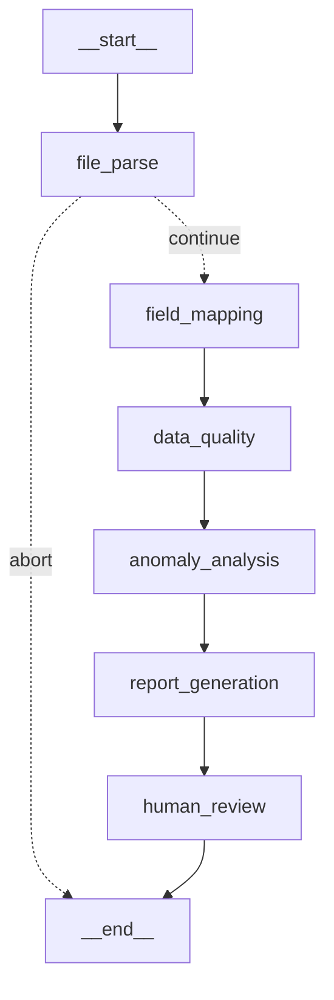

# 电商运营数字员工

上传订单 Excel/CSV → 自动识别字段 → 检测异常 → 生成运营日报 → 网页展示 / 命令行 → 一键推送到企微/飞书。

## 阶段演进

- **第一/二阶段**：规则引擎识别异常 + 统计指标 + 生成 **规则版** Markdown 日报（Web 上传即用）。
- **第三阶段（本次新增）**：在规则分析之上叠加 **AI 数字员工日报** + **命令行入口**。
  - 新增 `app/llm_reporter.py`：把规则分析结果交给 LLM，写成像运营人员手写的 7 板块日报（今日订单概况 / 重点异常问题 / 需要优先处理的订单 / 商品·库存风险 / 客服备注风险 / AI 运营建议 / 明日关注事项）。
  - 默认 **mock 模式**（确定性渲染，不依赖真实 API）；配置了 Key 则调真实模型（MiMo/Claude），失败自动回退 mock。
  - 新增 `run_stage3.py` 命令行：`--input / --output / --use-llm / --send-wecom`。
  - 规则分析能力（`app/analyzer.py`）完整保留，作为 AI 日报的基础数据。
- **第四阶段（本次新增）**：Web 界面——上传 → 看「数字员工执行过程」→ 预览 AI 日报 → **人工确认**后推送企业微信。
  - 网页展示分步执行：读取订单数据 → 识别异常订单 → 统计关键指标 → 生成 AI 运营日报 → 等待人工确认 → 已完成。
  - 报告生成后才出现「✅ 确认并推送到企业微信」按钮，点了才推（人在回路）。
  - 新增端点 `POST /api/send-wecom`；未配 `WECOM_WEBHOOK_URL` 时页面提示「已模拟推送」，不崩溃。
  - 复用现有 `analyzer.py` / `llm_reporter.py` / 企微推送逻辑；新增 `app/wecom_sender.py`（语义化薄封装，指向 `app/push.py`）和 `app/web_app.py`（入口别名，指向 `app/main.py`）。**命令行 `run_stage3.py` 保留不变。**
- **第 4.5 阶段（修正打磨，本次新增）**：提升严谨性与可效果，更适合面试录屏。
  - **行数显示**不再误导：上传区显示「预览 N 行，共 X 行数据」（X 为真实总行数）。
  - **字段识别增强**：中英文表头自动映射（见下方「字段映射规则」），新增 `store_name`，库存支持 `库存数量/stock_qty`，客服备注支持 `customer_note`。
  - **库存逻辑严谨**：未识别库存字段时输出「未识别库存字段，本次未进行库存风险分析」，不再误报「无明显风险」（客服备注同理）。
  - **数据质量提示**：报告末尾统一展示 已识别字段 / 未识别字段 / 本次未参与分析的检测 / 关键字段是否缺失。
  - **AI 报告更像业务日报**：强化业务判断（异常集中环节、优先级、今天必处理 vs 次日观察），语气更像运营负责人。
  - **页面优化**：报告区加「复制报告 / 下载 Markdown」，执行步骤区明确「人工确认节点」提示。
- **第五阶段（本次新增）**：把线性流程重构为 **LangGraph Agent Workflow**——同样的能力，但以清晰的「节点编排」呈现，更贴合 AI Agent / 数字员工 / 流程自动化岗位。执行步骤由**真实节点**产生（非前端假进度）。详见下方「第五阶段：LangGraph Agent Workflow」。
- **第 5.5 阶段（本次新增）**：打磨与实证。① 修正文案逻辑（修掉机械重复表述、「商品SKU」标签）；② 强化业务判断——日报按**业务环节**点明「主战场」，重点异常按 **🔴 高优先（今天必须处理）/ 🟡 中优先（次日跟进）** 分级，并补齐「订单金额异常」建议；③ **确认真 LangGraph 编排**——新增条件边（解析失败短路到 END，真正的图分支）、`GET /api/workflow-graph` 与 `python -m app.agent_workflow` 可导出节点/边/mermaid 自证。

## 第五阶段：LangGraph Agent Workflow

### 什么是 LangGraph Agent Workflow
把原来「上传→识别→分析→生成→确认→推送」的线性代码，重构成一张由 **节点（Node）+ 状态（State）+ 边（Edge）** 组成的有向图。每个业务步骤是一个独立、可测、可观测的节点；统一的 `AgentState` 在节点间流转；执行轨迹（steps）由节点真实产出。这让项目从「一段脚本」升级为「可编排的数字员工工作流」。

### 数字员工包含哪些节点（`app/nodes/`）
| 节点 | 职责 | 复用 |
|---|---|---|
| `FileParseNode` | 读 Excel/CSV，出总行数 / 预览 / 原始字段 / records；格式·空文件·读取错误处理 | `loader.py` |
| `FieldMappingNode` | 中英文表头 → 统一 canonical 字段，输出已识别/未识别 | `schema.py` |
| `DataQualityNode` | 关键字段缺失、订单号空值、金额/时间可解析、库存字段是否存在 | — |
| `AnomalyAnalysisNode` | 6 类规则异常（已付款未发货/物流/退款/库存/客服关键词/订单金额） | `analyzer.py` |
| `ReportGenerationNode` | 生成 7 板块 AI 日报（mock / 真实 LLM） | `llm_reporter.py` |
| `HumanReviewNode` | 设「等待人工确认」状态，不直接推送（人在回路） | — |
| `WecomPushNode` | 人工确认后推送企业微信，状态 skipped/success/failed/missing_webhook | `wecom_sender.py` |

编排在 [app/agent_workflow.py](app/agent_workflow.py)：
- `run_analysis_workflow()`：`START → file_parse → field_mapping → data_quality → anomaly_analysis → report_generation → human_review → END`
- `run_wecom_push_workflow()`：`START → wecom_push → END`（页面点「确认推送」后调用）

状态定义见 [app/agent_state.py](app/agent_state.py)（`steps/errors` 用 reducer 自动累加成执行轨迹）。

### 确认这是真 LangGraph 编排（5.5）
不是顺序函数调用，而是编译出的 `CompiledStateGraph`，且含**条件边**（解析失败直接短路到 END）：



随时自证：
```bash
python -m app.agent_workflow          # 打印引擎类型 + 节点 + mermaid
curl http://127.0.0.1:8000/api/workflow-graph   # 返回 nodes / edges(含 conditional) / mermaid
```

### 如何启动
```bash
pip install -r requirements.txt          # 含 langgraph / langchain-core
uvicorn app.web_app:app --reload         # 浏览器开 http://127.0.0.1:8000
# 命令行仍可用（未走图，直连底层函数，保持轻量）：
python run_stage3.py --input data/sample_orders.xlsx --output reports/ai_report.md --use-llm
```

### mock LLM vs 真实 LLM
- **mock**（默认/离线）：`ReportGenerationNode` 用确定性模板渲染 7 板块，不联网、可复现。
- **真实**：`.env` 配 `LLM_PROVIDER=mimo`、`LLM_BASE_URL`、`LLM_API_KEY`、`LLM_MODEL` 后，节点调真实模型（MiMo/Claude，Anthropic 兼容端点），失败自动回退 mock。页面勾「强制 mock」可临时离线。

### 企业微信 Webhook 配置
`.env` 设 `WECOM_WEBHOOK_URL=`（企业微信群机器人地址）。未配置时 `WecomPushNode` 返回 `missing_webhook` 并模拟成功，页面给提示，**不崩溃**。

### 本项目如何对应招聘 JD
- **AI Agents**：LangGraph 多节点工作流 + 统一 State + 人在回路（HITL）。
- **业务流程自动化**：把运营「读表→查异常→写日报→推送」端到端自动化。
- **Excel / CSV 文件处理**：pandas 读取 + 中英文字段容错映射 + 数据质量校验。
- **人工确认节点**：`HumanReviewNode` + 页面「确认并推送」按钮，体现可控性。
- **企业系统推送**：对接企业微信群机器人（可扩展飞书）。
- **快速落地数字员工**：Web 可上传即跑，节点清晰可讲、可扩展。

## 字段映射规则（4.5）

上传文件的表头会被自动映射到内部标准字段（canonical），中英文皆可、大小写不敏感、支持别名。常见映射：

| 标准字段 | 可识别表头（示例）|
|---|---|
| order_id | 订单号 / 订单编号 / order_id |
| store_name | 店铺名称 / 店铺 / store_name |
| product_name | 商品名称 / 宝贝名称 / product_name |
| amount | 订单金额 / 实付金额 / amount |
| pay_status | 支付状态 / 付款状态 / pay_status |
| pay_time | 支付时间 / 付款时间 / pay_time |
| ship_status | 发货状态 / shipping_status / ship_status |
| logistics_status | 物流状态 / 快递状态 / logistics_status |
| refund_status | 退款状态 / refund_status |
| stock | 库存 / 库存数量 / stock / stock_qty |
| cs_note | 客服备注 / 备注 / customer_note |

**关键字段**为 `order_id / pay_status / ship_status`，缺失时会在「数据质量提示」里告警。未映射上的列会列为「未识别字段」，不影响其余分析。

## 数据质量提示的意义（4.5）

每份报告末尾的「数据质量提示」让看报告的人**清楚边界**——哪些字段被用上、哪些没被识别、哪些检测因缺字段没做、关键字段是否缺失。避免「没分析」被误读成「没问题」，是 严谨性的体现。

## 展示流程（建议录屏顺序）

1. 打开页面 → 上传 `data/sample_orders.xlsx`（看「预览 5 行，共 15 行」+ 字段识别）。
2. 勾「使用 AI 日报」→ 开始分析 → 看「数字员工执行过程」逐步跑完。
3. 预览 7 板块 AI 日报（含业务判断 + 末尾数据质量提示）。
4. 点「复制报告 / 下载 Markdown」导出。
5. 在「人工确认节点」点「✅ 确认并推送到企业微信」（未配 webhook 走模拟，有提示）。

## 第四阶段：Web 运行方式

```bash
pip install -r requirements.txt          # 或 bash run.sh 一键
uvicorn app.web_app:app --reload         # 等价于 uvicorn app.main:app --reload
```

浏览器打开 **http://127.0.0.1:8000** ，完整流程：

1. **上传** `.xlsx / .csv` 订单文件（可直接用 `data/sample_orders.xlsx`）。
2. 勾选 **使用 AI 日报**（可选 **强制 mock** 离线）→ 点 **开始分析**。
3. 看「数字员工执行过程」分步跑完，下方**预览 AI 运营日报**。
4. 点 **✅ 确认并推送到企业微信**。

**配置企业微信 Webhook**（真推时）：在 `.env` 里设置 `WECOM_WEBHOOK_URL=`（企业微信群机器人「添加机器人」里复制的地址）。不配也会走模拟推送并在页面提示。

接口：`GET /`（页面）、`POST /api/upload`、`POST /api/analyze`（返回 `steps` + 报告）、`POST /api/send-wecom`（人工确认推送）。

## 它能做什么

- **上传** `.csv / .xlsx / .xls`（CSV 自动兼容 utf-8 / gbk 编码）
- **容错列识别**：canonical 字段 ↔ 中文表头 + 别名，缺列自动跳过对应检测并在日报里提示
- **5 类异常检测**
  1. 已付款未发货（超 N 小时标「严重」）
  2. 物流异常 / 超时（异常状态，或已发货后 N 天无更新）
  3. 退款状态异常（退款失败/异常，或退款中超 N 天）
  4. 库存不足（库存 ≤ 0 / 小于本单数量 / 低于阈值）
  5. 客服备注关键词（投诉/催发货/质量问题/退款…）
- **运营日报**：数据概览 + LLM 智能洞察与建议 + 异常明细表 + 数据质量提示
- **LLM 接口**：provider-agnostic，默认 `mock`（无需联网），预留 OpenAI/Claude/Qwen 接入位
- **推送**：统一 `push_report(md, channel)`，企微 / 飞书 webhook；未配 URL 自动 mock 成功

## 快速开始

```bash
# 方式一：一键脚本（自动建 venv + 装依赖 + 起服务）
bash run.sh

# 方式二：手动
python3 -m venv .venv && source .venv/bin/activate
pip install -r requirements.txt
uvicorn app.main:app --reload --port 8000
```

打开 http://127.0.0.1:8000 ，上传 `data/sample_orders.csv` → 点「开始分析」→ 查看日报 → 点「推送」。

> ⚠️ 本机若是 Python 3.14 且 `pip install pandas` 失败（无 wheel），请用 3.12/3.13 建 venv，`run.sh` 已优先探测。

## 第三阶段：命令行生成 AI 日报

```bash
source .venv/bin/activate

# 规则版日报
python run_stage3.py --input data/sample_orders.xlsx --output reports/report.md

# AI 数字员工日报（默认 mock；配了 MiMo/Claude Key 自动走真实模型）
python run_stage3.py --input data/sample_orders.xlsx --output reports/ai_report.md --use-llm

# 生成 AI 日报并推送到企业微信（未配 webhook 时自动 mock，不报错）
python run_stage3.py --input data/sample_orders.xlsx --output reports/ai_report.md --use-llm --send-wecom

# 想验证离线 mock 渲染，强制不调真实模型：
python run_stage3.py --input data/sample_orders.xlsx --output reports/ai_report.md --use-llm --force-mock
```

| 参数 | 说明 |
|---|---|
| `--input` | 输入订单文件（`.xlsx/.xls/.csv`） |
| `--output` | 输出 Markdown 日报路径（自动建目录） |
| `--use-llm` | 生成 AI 风格 7 板块日报；不加则生成规则版 |
| `--send-wecom` | 推送到企业微信（复用 `app/push.py`，未配 `WECOM_WEBHOOK_URL` 时 mock） |
| `--force-mock` | AI 日报强制走 mock，不调真实模型 |

### 配 LLM（让 `--use-llm` 调真实模型）

在 `.env` 里设置（已支持 MiMo / Claude，走 Anthropic 兼容端点）：

```bash
LLM_PROVIDER=mimo
LLM_BASE_URL=https://token-plan-cn.xiaomimimo.com/anthropic
LLM_API_KEY=你的key
LLM_MODEL=mimo-v2.5
```

不配也能用：`--use-llm` 会走 mock 渲染，产出同样的 7 板块结构。

## 运行测试

```bash
source .venv/bin/activate
python -m pytest tests/ -q
```

## 配置

复制 `.env.example` 为 `.env`，按需填写。全部留空也能跑通（走 mock）。

| 变量 | 作用 |
|---|---|
| `LLM_PROVIDER` | `mock`(默认)/`openai`/`claude`/`qwen` |
| `*_API_KEY` | 对应 LLM 凭证 |
| `WECOM_WEBHOOK_URL` | 企微群机器人 webhook |
| `FEISHU_WEBHOOK_URL` | 飞书自定义机器人 webhook |
| `PAY_NO_SHIP_HOURS` 等 | 异常判定阈值 |

## 目录结构

```
app/
  config.py       阈值/关键词/凭证收口
  schema.py       列别名映射 + 规整
  analyzer.py     ★5 类异常检测（纯函数，可被 Agent 当 tool 复用）
  loader.py       订单文件读取（CSV/Excel）单一入口
  report.py       规则版 Markdown 日报
  llm.py          LLM 抽象 + MockLLM + 真实端点（summarize/complete）
  llm_reporter.py ★第三阶段：7 板块 AI 数字员工日报（mock + 真实，复用 llm.py）
  push.py         企微/飞书 统一推送
  wecom_sender.py ★第四阶段：企微推送语义入口（薄封装 → push.py）
  agent_state.py  ★第五阶段：LangGraph 统一 AgentState
  agent_workflow.py ★第五阶段：节点编排（run_analysis_workflow / run_wecom_push_workflow）
  nodes/          ★第五阶段：7 个节点（file_parse/field_mapping/data_quality/
                  anomaly_analysis/report_generation/human_review/wecom_push）
  api/routes.py   /api/upload  /api/analyze(→workflow)  /api/send-wecom(→workflow)  /api/push
  main.py         FastAPI 入口 + 静态页托管
  web_app.py      ★第四阶段：Web 入口别名（→ main.py，供 uvicorn app.web_app:app）
run_stage3.py     第三阶段命令行入口（--input/--output/--use-llm/--send-wecom）
static/           ★第四阶段：上传/执行步骤/AI 日报预览/人工确认推送（原生 JS）
data/             sample_orders.csv / .xlsx + uploads/
tests/            analyzer 单测
```

## 接口

| 方法 | 路径 | 说明 |
|---|---|---|
| POST | `/api/upload` | 上传文件，返回 file_id + 列识别 + 预览 |
| POST | `/api/analyze` | `{file_id, use_llm, force_mock}` → 分析 + 日报 + 执行步骤 |
| POST | `/api/send-wecom` | `{report_markdown}` → 人工确认后推送企业微信 |
| GET | `/api/workflow-graph` | LangGraph 编排结构（nodes/edges/mermaid），自证真编排 |
| POST | `/api/push` | `{report_markdown, channel}` → 通用推送（含飞书）|

## 后续演进（迈向「真正的数字员工」）

- **接真 LLM**：在 `app/llm.py` 实现 OpenAILLM/ClaudeLLM/QwenLLM，让洞察更有价值
- **持久化**：引入 SQLite（对齐 `AI_Agent_claude/db/`），支持历史/回看
- **环比维度**：支持两份文件对比，看异常趋势
- **融合 Agent（关键）**：`analyzer.py / report.py / push.py` 均为纯函数模块，
  可直接注册为 `AI_Agent_claude` 里 Agent 的 tools，由 Agent 自主决定
  「读文件→分析→生成→推送」，Web 界面作为触发入口，共享同一套数据层。
- **富文本推送**：企微/飞书升级为卡片消息（分级颜色 + 跳转）
